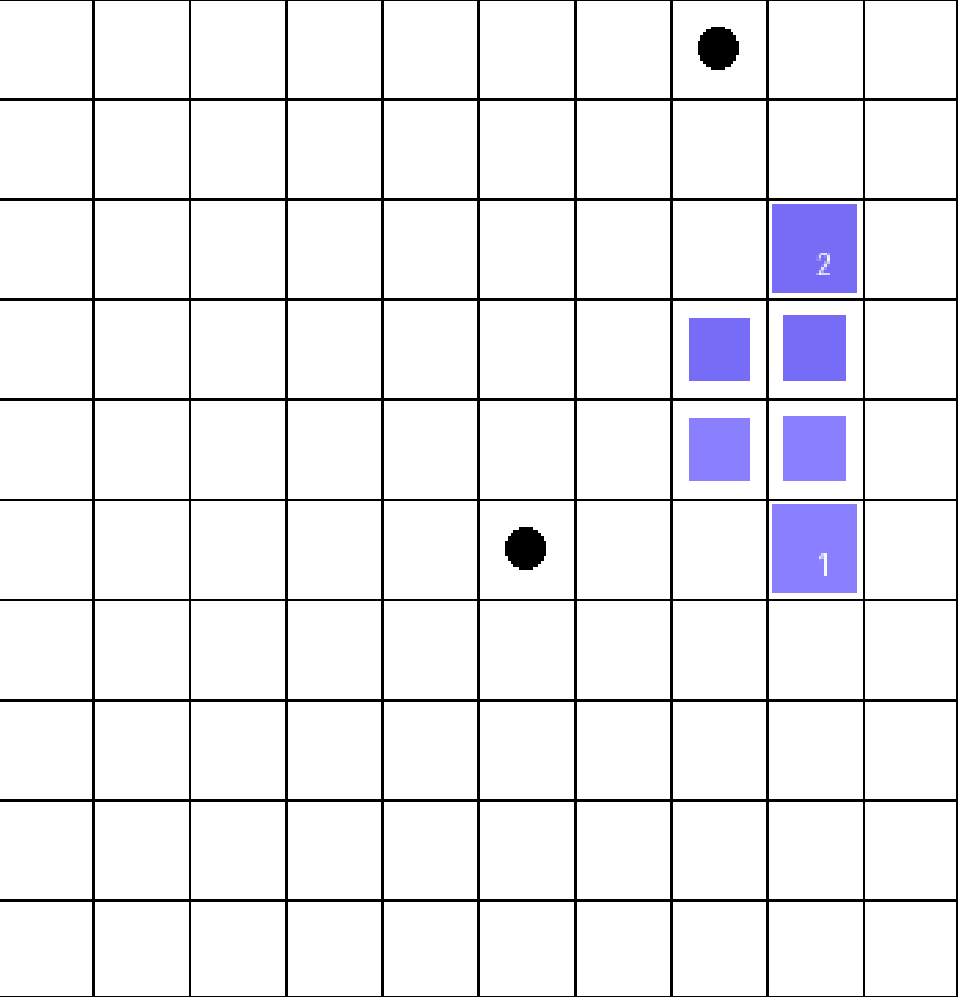
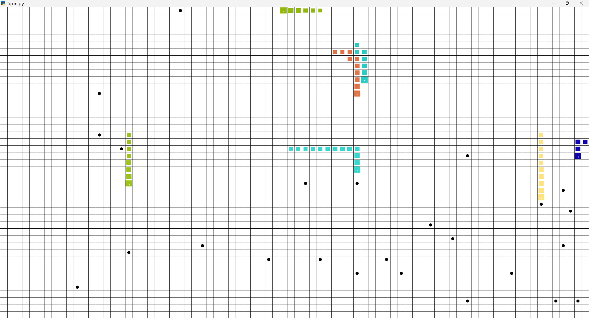
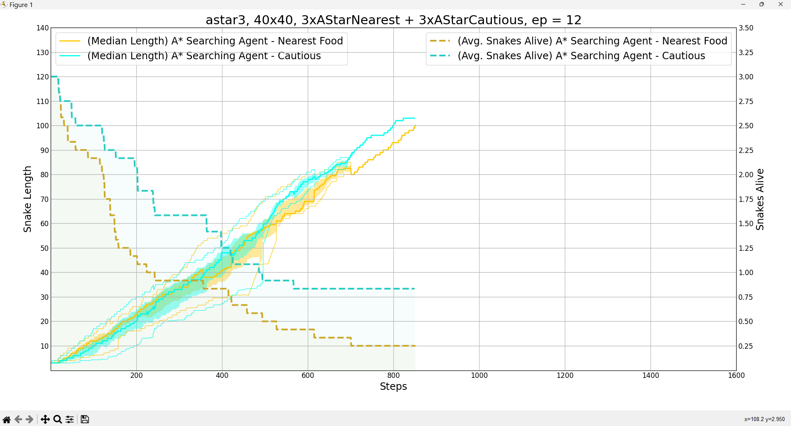

# The Snake Game 

This is a multiplayer version of the well-known snake game where two teams of
snakes must compete for grid-world domination. SnakeGame  works with gym API
and its suitable for benchmarking multi agent systems. 

Get large or die trying!


# Before we begin

## (Recommended) using anaconda/miniconda

1. Create an environment just for this project (no need to mess with dependency pinning)

```
conda env create -f conda_environment.yml
```

2. Activate the environment:
```
conda activate snake
```

3. Test everything is OK
```
python ./run.py --scenario randoms -r
```

## "Manual" Installation

This may need some tinkering with dependency pinning. You're on your own here.

1. (Recommended) Create virtual environment
```
$ python3 -m venv venv
$ source venv/bin/activate
```

...or if you're on Windows:

```
python -m venv venv
./venv/Scripts/activate.bat
```

2. Install dependencies
```
pip install -r requirements.txt
```

3. Test everything is OK
```
python ./run.py --scenario randoms -r
```

And you're ready to go!


# Quick Docs




## Observations Snake 1

- self: index for the snake.
- grid: 2D array_like, representing the grid-world where:
    - '0': Empty cell.
    - 'F': Food item.
    - 'H\<i>': Head of snake i. 
    - 'B\<i>': Body for snake i.
- grid_shape: A tuple, representing the dimensions of the grid. 
- agents: dictionary, where the keys are the snake i-1, and the itens are a
  list of tuples, each tuple contains the head and body for the snake. The
  list's first element is the tuple representing the position of the head.
- directions: list of tuples, representing the four cardinal directions
  that the head of the snake can face.
- direction_ptr: dictionary, the keys are the snake i-1, and the items are
  the position of the direction the head of the snake i faces. 

```py
{
    'self': 0, 
    'grid': [
        ['0', '0', '0', '0', '0', '0', '0', 'F', '0', '0'], 
        ['0', '0', '0', '0', '0', '0', '0', '0', '0', '0'], 
        ['0', '0', '0', '0', '0', '0', '0', '0', 'H2', '0'], 
        ['0', '0', '0', '0', '0', '0', '0', 'B2', 'B2', '0'], 
        ['0', '0', '0', '0', '0', '0', '0', 'B1', 'B1', '0'], 
        ['0', '0', '0', '0', '0', 'F', '0', '0', 'H1', '0'], 
        ['0', '0', '0', '0', '0', '0', '0', '0', '0', '0'], 
        ['0', '0', '0', '0', '0', '0', '0', '0', '0', '0'], 
        ['0', '0', '0', '0', '0', '0', '0', '0', '0', '0'], 
        ['0', '0', '0', '0', '0', '0', '0', '0', '0', '0']
      ], 
     'grid_shape': (10, 10), 
     'agents': {
        0: [(5, 8), (4, 8), (4, 7)], 
        1: [(2, 8), (3, 8), (3, 7)]
      }, 
     'directions': [(1, 0), (0, 1), (-1, 0), (0, -1)], 
     'direction_ptr': {0: 0, 1: 2}, 
     'food': [[5, 5], [0, 7]]
}
```

## Actions

The actions are turn left, move forward and turn right. The actions indices
are (-1, 0, 1) respectively.


# Quick Start
This project runs on "scenarios", which are configurations for a certain environment (a different set of agents, a different grid configuration, etc.). We've already prepared some for you to run.

You can create your own scenarios by editing the `config.py` file, here's a template!

```py
"scenario_name": {
    "output": "default_name.json",
    "agents": [
        YourAgentHereA(),
        YourAgentHereA(),
        YourAgentHereA(),
        YourAgentHereA(),
        YourAgentHereB(),
        YourAgentHereB(),
        YourAgentHereB(),
        YourAgentHereB()
    ],
    "grid": (50, 50)
}
```


## Running the environment

```
python ./run.py --scenario SCENARIO [-n EPISODES=1] [-e [EXPORT]] [-r] [-p PROCESSES=1]
```

- `--scenario` - The name of the scenario to run (as configured in `config.py`)
- `-n`, `--episodes` - How many instances of this scenario to simulate?
- `-e`, `--export` - Record the simulation results. Optionally provide a file where to save them to.
- `-r`, `--render` - Render the simulation to screen (takes longer to complete, not recommended if you're running a lot of episodes)
- `-p`, `--processes` - Split the workload among multiple processes. Simulation data is then joined at the end and written to one file (if applicable).




## Plotting the performance of agents

If you used the `--export` option previously, you probably now have a json dump file. You can run

```
python ./plot.py simulation_output.json
```

To obtain a plot of the performance of your agents for that (or those) simulation(s).




# References

```
@inproceedings{yeh_2016,
  author={Yeh, Jia-Fong and Su, Pei-Hsiu and Huang, Shi-Heng and Chiang, Tsung-Che},
  booktitle={2016 Conference on Technologies and Applications of Artificial Intelligence (TAAI)}, 
  title={Snake game AI: Movement rating functions and evolutionary algorithm-based optimization}, 
  year={2016},
  volume={},
  number={},
  pages={256-261},
  keywords={Games;Artificial intelligence;Evolutionary computation;Optimization;Computers;Turning;Weapons;game;artificial intelligence (AI);snake;evolutionary algorithm},
  doi={10.1109/TAAI.2016.7880166}
}

@inproceedings{sharma_2019,
  author={Sharma, Shubham and Mishra, Saurabh and Deodhar, Nachiket and Katageri, Akshay and Sagar, Parth},
  booktitle={2019 IEEE Pune Section International Conference (PuneCon)}, 
  title={Solving The Classic Snake Game Using AI}, 
  year={2019},
  volume={},
  number={},
  pages={1-4},
  keywords={Best First Search;Breadth First Search;Greedy Search;A* Search;A* with Forward Checking;Snake Game;Artificial Intelligence;Random move;Almighty move;Automated Bot},
  doi={10.1109/PuneCon46936.2019.9105796}
}
  
@inproceedings{büttner_2021,
author = {Büttner, Johannes and von Mammen, Sebastian},
    year = {2021},
    month = {08},
    pages = {1-5},
    title = {Training a Reinforcement Learning Agent based on XCS in a Competitive Snake Environment},
    doi = {10.1109/CoG52621.2021.9619161}
}

```
